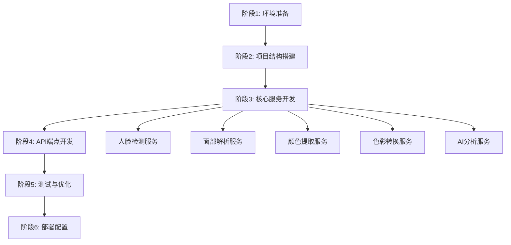

# 🏗️ Seasonal Color Analysis API - 重建项目完整流程

## 📋 项目重建指南 | Project Rebuild Guide

基于现有项目的技术分析，这是一个从零开始重新构建**季节色彩分析API**的完整流程。

---

## 🎯 项目概述

**项目名称**: Seasonal Color Analysis API (Beauty Assistant Backend)  
**技术栈**: FastAPI + PyTorch + Computer Vision + AI  
**主要功能**: 人脸检测 → 面部解析 → 颜色提取 → 色彩空间转换 → AI季节色彩分析

---

## 📊 重建流程总览



---

## 🚀 阶段1: 环境准备 (预计时间: 30分钟)

### 1.1 系统要求

```bash
# 操作系统
- Windows 10/11, macOS, Linux (Ubuntu 20.04+)

# 硬件要求
- CPU: 4核心以上
- RAM: 8GB以上 (推荐16GB)
- 磁盘: 20GB可用空间
- GPU: NVIDIA GPU (可选，用于加速)
```

### 1.2 安装Python环境

```bash
# 1. 下载并安装Python 3.11.x
# 访问: https://www.python.org/downloads/
# 选择Python 3.11.9或任何3.11.x版本

# 2. 验证安装
python --version
# 应显示: Python 3.11.x

# 3. 升级pip
python -m pip install --upgrade pip
```

### 1.3 创建项目目录

```bash
# 创建项目根目录
mkdir seasonal_color_api
cd seasonal_color_api

# 创建虚拟环境
python -m venv venv

# 激活虚拟环境
# Windows:
venv\Scripts\activate
# Linux/Mac:
source venv/bin/activate
```

### 1.4 安装核心依赖

创建 `requirements.txt`:

```txt
# FastAPI and core dependencies
fastapi==0.115.12
uvicorn[standard]==0.32.1

# Data validation and serialization
pydantic==2.10.3
pydantic-settings==2.7.0

# Environment variables
python-dotenv==1.0.1

# Authentication and security
python-jose[cryptography]==3.3.0
passlib[bcrypt]==1.7.4
python-multipart==0.0.20

# Image processing for beauty analysis
Pillow==11.0.0
numpy==1.24.3
opencv-python==4.8.1.78
colorgram.py==1.2.0

# Face detection and recognition
torch==2.1.0
torchvision==0.16.0
facenet-pytorch==2.5.3

# HTTP client for external APIs
httpx==0.28.1

# Development dependencies
pytest==8.3.4
pytest-asyncio==0.25.0

# ONNX Runtime for model inference
onnxruntime==1.16.0
```

安装依赖：

```bash
pip install -r requirements.txt
```

---

## 🏗️ 阶段2: 项目结构搭建 (预计时间: 1小时)

### 2.1 创建目录结构

```bash
# 创建主要目录
mkdir -p app/{api,core,models,schemas,services,utils,weights}
mkdir -p app/api/{endpoints,routes}
mkdir -p uploads output temp third_party

# 创建__init__.py文件
touch app/__init__.py
touch app/api/__init__.py
touch app/api/endpoints/__init__.py
touch app/api/routes/__init__.py
touch app/core/__init__.py
touch app/models/__init__.py
touch app/schemas/__init__.py
touch app/services/__init__.py
touch app/utils/__init__.py
```

### 2.2 完整目录结构

```
seasonal_color_api/
├── app/
│   ├── __init__.py
│   ├── main.py                      # FastAPI应用入口
│   ├── api/
│   │   ├── __init__.py
│   │   ├── router.py                # 路由聚合器
│   │   ├── endpoints/
│   │   │   ├── __init__.py
│   │   │   ├── analysis.py          # 分析端点
│   │   │   └── storage.py           # 存储端点
│   │   └── routes/
│   │       └── __init__.py
│   ├── core/
│   │   ├── __init__.py
│   │   ├── config.py                # 配置管理
│   │   ├── database.py              # 数据库配置
│   │   └── dependencies.py          # 依赖注入
│   ├── models/
│   │   ├── __init__.py
│   │   ├── analysis.py              # 分析数据模型
│   │   └── user.py                  # 用户模型
│   ├── schemas/
│   │   ├── __init__.py
│   │   ├── color_result.py          # 颜色结果schema
│   │   ├── face_detection.py        # 人脸检测schema
│   │   └── storage.py               # 存储schema
│   ├── services/
│   │   ├── __init__.py
│   │   ├── face_detector.py         # 人脸检测服务
│   │   ├── face_parser.py           # 面部解析服务
│   │   ├── color_extractor.py       # 颜色提取服务
│   │   ├── rgb_to_CIELAB.py         # RGB转CIELAB
│   │   ├── rgb_to_hsv.py            # RGB转HSV
│   │   └── color_analysis.py        # Gemini AI分析
│   ├── utils/
│   │   └── __init__.py
│   └── weights/
│       └── resnet34.onnx            # 面部解析模型
├── uploads/                          # 上传文件目录
├── output/                           # 输出结果目录
├── temp/                             # 临时文件目录
├── third_party/                      # 第三方库
├── .env                              # 环境变量
├── .env.example                      # 环境变量示例
├── requirements.txt                  # Python依赖
├── run_server.py                     # 服务器启动脚本
└── README.md                         # 项目文档
```
```
beauty_backend/ 
├── app/ 
│   ├── init.py 
│   ├── main.py # Entry point (initializes FastAPI app) 
│   ├── api/ # PRESENTATION LAYER (Controllers/Routes) 
│   ├── v1/ 
│   │   ├── router.py # Aggregates all routers 
│   │   ├── analysis.py # POST /analyze/color (Calls AnalysisService) 
│   │   └── products.py # GET /products (Calls ProductService) 
│   │   └── dependencies.py # Dependency Injection (get_db, get_current_user) 
│   ├── core/ # INFRASTRUCTURE 
│   │   ├── config.py # Env vars (DB_URL, SECRET_KEY) 
│   │   ├── security.py # JWT, Password Hashing 
│   │   └── exceptions.py # Custom error handlers 
│   ├── schemas/ # DTOs (Pydantic Models - Data Validation) 
│   │   ├── analysis_dto.py # Input: ImageBase64, Output: SeasonResult 
│   │   ├── product_dto.py # API Response models 
│   │   └── user_dto.py 
│   ├── services/ # BUSINESS LOGIC LAYER (The Brain) 
│   │   ├── auth_service.py 
│   │   ├── analysis_service.py # Orchestrates: Image -> ML Engine -> Repo -> Response 
│   │   └── recommendation_service.py 
│   ├── repositories/ # DATA ACCESS LAYER (Database only) 
│   │   ├── base_repo.py # Generic CRUD (Create, Read, Update, Delete) 
│   │   ├── user_repo.py # DB queries for Users 
│   │   ├── analysis_repo.py # DB queries to save Analysis history 
│   │   └── product_repo.py 
│   ├── models/ # DATABASE MODELS (SQLAlchemy/SQLModel Tables) 
│   │   ├── user.py 
│   │   ├── analysis_log.py 
│   │   └── product.py 
│   ├── ml_engine/ # AI CORE (Isolated from API) 
│   │ ├── loader.py # Loads heavy models once at startup (Singleton) 
│   │ ├── seasonal/ 
│   │ │ ├── detector.py # MediaPipe Logic 
│   │ │ ├── color_math.py # CIELAB/HSV conversions 
│   │ │ └── classifier.py # The 12-season logic 
│   │ └── skin/ 
│   │ ├── acne_detect.py # YOLOv8/TensorFlow inference 
│   │ └── texture.py # OpenCV logic 
│   ├── data/ # Static files (weights, temp images) 
│   ├── tests/ # Unit tests  
├── requirements.txt 
└──.env
```
---
---

## 💻 阶段3: 核心服务开发 (预计时间: 8-10小时)

### 3.1 配置管理 (`app/core/config.py`)

```python
#!/usr/bin/env python3
"""
Application configuration settings
"""

from pydantic_settings import BaseSettings
from typing import List
import os
from pathlib import Path

class Settings(BaseSettings):
    """
    Application settings loaded from environment variables or .env file
    """
    # Database configuration
    mysql_host: str = "localhost"
    mysql_port: int = 3306
    mysql_user: str = "root"
    mysql_password: str = ""
    mysql_database: str = "beauty_assistant"
    
    # Application configuration
    app_name: str = "Beauty Assistant API"
    app_version: str = "1.0.0"
    debug: bool = True
    
    # Security configuration
    secret_key: str = "your-secret-key-change-in-production"
    algorithm: str = "HS256"
    access_token_expire_minutes: int = 30
    
    # Gemini API configuration
    gemini_api_key: str = ""
    
    # CORS configuration
    allowed_origins: List[str] = ["*"]
    
    # File upload configuration
    max_file_size: int = 10 * 1024 * 1024  # 10MB
    allowed_image_types: List[str] = ["image/jpeg", "image/png", "image/jpg"]
    
    # Paths configuration
    base_dir: Path = Path(__file__).parent.parent.parent
    upload_dir: Path = base_dir / "uploads"
    output_dir: Path = base_dir / "output"
    temp_dir: Path = base_dir / "temp"
    
    class Config:
        env_file = ".env"
        env_file_encoding = "utf-8"
        case_sensitive = False

# Create global settings instance
settings = Settings()

# Ensure required directories exist
for directory in [settings.upload_dir, settings.output_dir, settings.temp_dir]:
    os.makedirs(directory, exist_ok=True)
```

### 3.2 人脸检测服务 (`app/services/face_detector.py`)

```python
#!/usr/bin/env python3
"""
Face detection service using MediaPipe FaceMesh
"""

from facenet_pytorch import MTCNN
from PIL import Image
import torch
import numpy as np
from pathlib import Path
from typing import Dict, List, Tuple, Optional
import logging

logger = logging.getLogger(__name__)

class FaceDetector:
    """Face detection using MediaPipe FaceMesh model"""
    
    def __init__(self, device: str = 'auto'):
        """
        Initialize MediaPipe FaceMesh face detector
        
        Args:
            device: 'cuda', 'cpu', or 'auto'
        """
        if device == 'auto':
            self.device = 'cuda' if torch.cuda.is_available() else 'cpu'
        else:
            self.device = device
            
        logger.info(f"Initializing MediaPipe FaceMesh on device: {self.device}")
        
        self.facemesh = FaceMesh(
            static_image_mode=True,
            max_num_faces=1,
            refine_landmarks=True,
            min_detection_confidence=0.5,
            min_tracking_confidence=0.5,
            device=self.device
        )
    
    def detect_faces(self, image: Image.Image) -> Tuple[Optional[torch.Tensor], Optional[torch.Tensor]]:
        """
        Detect faces in image
        
        Args:
            image: PIL Image
            
        Returns:
            Tuple of (bounding_boxes, probabilities)
        """
        boxes, probs = self.mtcnn.detect(image)
        return boxes, probs
    
    def crop_faces(
        self, 
        image: Image.Image, 
        boxes: torch.Tensor,
        output_dir: Path,
        file_prefix: str = "face"
    ) -> List[str]:
        """
        Crop detected faces and save to files
        
        Args:
            image: Original PIL Image
            boxes: Bounding boxes from detection
            output_dir: Directory to save cropped faces
            file_prefix: Prefix for saved files
            
        Returns:
            List of saved file paths
        """
        saved_paths = []
        
        for idx, box in enumerate(boxes):
            x1, y1, x2, y2 = [int(coord) for coord in box]
            
            # Crop face region
            face_img = image.crop((x1, y1, x2, y2))
            
            # Save cropped face
            output_path = output_dir / f"{file_prefix}_{idx}.jpg"
            face_img.save(output_path)
            saved_paths.append(str(output_path))
            
        return saved_paths

def validate_image_for_face_detection(image_path: str) -> Tuple[bool, str]:
    """
    Validate image for face detection
    
    Args:
        image_path: Path to image file
        
    Returns:
        Tuple of (is_valid, error_message)
    """
    try:
        img = Image.open(image_path)
        
        # Check image size
        if img.width < 200 or img.height < 200:
            return False, "Image too small (minimum 200x200 pixels)"
        
        # Check image mode
        if img.mode not in ['RGB', 'L']:
            img = img.convert('RGB')
        
        return True, ""
        
    except Exception as e:
        return False, f"Invalid image: {str(e)}"

def analyze_face_detection(
    image: Image.Image,
    save_crops: bool = True,
    output_dir: Optional[Path] = None
) -> Dict:
    """
    Complete face detection analysis
    
    Args:
        image: PIL Image
        save_crops: Whether to save cropped faces
        output_dir: Directory for output files
        
    Returns:
        Dictionary with detection results
    """
    detector = FaceDetector()
    
    # Detect faces
    boxes, probs = detector.detect_faces(image)
    
    result = {
        "has_face": boxes is not None and len(boxes) > 0,
        "face_count": len(boxes) if boxes is not None else 0,
        "image_size": {"width": image.width, "height": image.height},
        "bounding_boxes": boxes.tolist() if boxes is not None else [],
        "confidence_scores": probs.tolist() if probs is not None else [],
        "cropped_faces": []
    }
    
    # Crop and save faces if requested
    if save_crops and boxes is not None and output_dir:
        import uuid
        file_id = uuid.uuid4().hex[:8]
        cropped_paths = detector.crop_faces(image, boxes, output_dir, f"face_{file_id}")
        result["cropped_faces"] = cropped_paths
    
    return result
```

### 3.3 面部解析服务 (`app/services/face_parser.py`)

这是一个复杂的服务，需要实现：
- BiSeNet模型加载（ONNX格式）
- 19个面部区域分割
- 颜色提取集成

```python
#!/usr/bin/env python3
"""
Face parsing service using BiSeNet model
"""

import onnxruntime as ort
import numpy as np
from PIL import Image
import cv2
from pathlib import Path
from typing import Dict, List, Tuple, Optional
from dataclasses import dataclass
import logging

logger = logging.getLogger(__name__)

# Face parsing region labels
FACE_REGIONS = {
    0: 'background',
    1: 'skin',
    2: 'nose',
    3: 'eye_g',      # eye glasses
    4: 'l_eye',      # left eye
    5: 'r_eye',      # right eye
    6: 'l_brow',     # left eyebrow
    7: 'r_brow',     # right eyebrow
    8: 'l_ear',      # left ear
    9: 'r_ear',      # right ear
    10: 'mouth',
    11: 'u_lip',     # upper lip
    12: 'l_lip',     # lower lip
    13: 'hair',
    14: 'hat',
    15: 'ear_r',     # ear ring
    16: 'neck_l',    # necklace
    17: 'neck',
    18: 'cloth'
}

@dataclass
class FaceParsingResult:
    """Face parsing result data class"""
    success: bool
    mask: np.ndarray
    original_image: np.ndarray
    image_size: Tuple[int, int]
    processed_size: Tuple[int, int]
    regions_map: Dict[str, int]
    confidence: float = 0.0

class FaceParser:
    """Face parsing using BiSeNet ONNX model"""
    
    def __init__(self, model_path: str, device: str = 'auto'):
        """
        Initialize face parser
        
        Args:
            model_path: Path to ONNX model file
            device: 'cuda' or 'cpu'
        """
        self.model_path = model_path
        self.model = None
        self.input_size = (512, 512)
        
        # Set ONNX Runtime providers
        if device == 'cuda':
            self.providers = ['CUDAExecutionProvider', 'CPUExecutionProvider']
        else:
            self.providers = ['CPUExecutionProvider']
    
    def load_model(self) -> bool:
        """Load ONNX model"""
        try:
            self.model = ort.InferenceSession(
                self.model_path,
                providers=self.providers
            )
            logger.info(f"Model loaded successfully from {self.model_path}")
            return True
        except Exception as e:
            logger.error(f"Failed to load model: {e}")
            return False
    
    def preprocess_image(self, image: Image.Image) -> np.ndarray:
        """
        Preprocess image for model input
        
        Args:
            image: PIL Image
            
        Returns:
            Preprocessed numpy array
        """
        # Resize to model input size
        img_resized = image.resize(self.input_size, Image.BILINEAR)
        
        # Convert to numpy array
        img_array = np.array(img_resized, dtype=np.float32)
        
        # Normalize to [0, 1]
        img_array = img_array / 255.0
        
        # Transpose to (C, H, W)
        img_array = img_array.transpose(2, 0, 1)
        
        # Add batch dimension
        img_array = np.expand_dims(img_array, axis=0)
        
        return img_array
    
    def parse_face(self, image_path: str) -> FaceParsingResult:
        """
        Parse face regions from image
        
        Args:
            image_path: Path to image file
            
        Returns:
            FaceParsingResult object
        """
        # Load image
        image = Image.open(image_path).convert('RGB')
        original_size = image.size
        
        # Preprocess
        input_array = self.preprocess_image(image)
        
        # Run inference
        input_name = self.model.get_inputs()[0].name
        output_name = self.model.get_outputs()[0].name
        
        result = self.model.run([output_name], {input_name: input_array})
        
        # Get segmentation mask
        mask = result[0][0].argmax(axis=0)
        
        # Get detected regions
        unique_labels = np.unique(mask)
        regions_map = {FACE_REGIONS[label]: label for label in unique_labels if label in FACE_REGIONS}
        
        return FaceParsingResult(
            success=True,
            mask=mask,
            original_image=np.array(image),
            image_size=original_size,
            processed_size=self.input_size,
            regions_map=regions_map,
            confidence=0.95  # Placeholder
        )
    
    def get_region_stats(self, result: FaceParsingResult) -> Dict:
        """
        Get statistics for each detected region
        
        Args:
            result: FaceParsingResult object
            
        Returns:
            Dictionary of region statistics
        """
        stats = {}
        total_pixels = result.mask.size
        
        for region_name, label in result.regions_map.items():
            pixel_count = np.sum(result.mask == label)
            percentage = (pixel_count / total_pixels) * 100
            
            stats[region_name] = {
                "pixel_count": int(pixel_count),
                "percentage": round(percentage, 2)
            }
        
        return stats
    
    def visualize_parsing(
        self,
        image_path: str,
        result: FaceParsingResult,
        output_path: str
    ) -> np.ndarray:
        """
        Create visualization of parsing result
        
        Args:
            image_path: Original image path
            result: FaceParsingResult object
            output_path: Path to save visualization
            
        Returns:
            Visualization image array
        """
        # Create colored mask
        color_map = self._get_color_map()
        colored_mask = color_map[result.mask]
        
        # Resize mask to original image size
        colored_mask_resized = cv2.resize(
            colored_mask,
            result.image_size,
            interpolation=cv2.INTER_NEAREST
        )
        
        # Blend with original image
        original = result.original_image
        blended = cv2.addWeighted(original, 0.6, colored_mask_resized, 0.4, 0)
        
        # Save visualization
        cv2.imwrite(output_path, cv2.cvtColor(blended, cv2.COLOR_RGB2BGR))
        
        return blended
    
    def _get_color_map(self) -> np.ndarray:
        """Generate color map for visualization"""
        color_map = np.zeros((19, 3), dtype=np.uint8)
        color_map[0] = [0, 0, 0]        # background
        color_map[1] = [255, 200, 150]  # skin
        color_map[2] = [255, 150, 100]  # nose
        color_map[3] = [100, 100, 100]  # eye glasses
        color_map[4] = [50, 150, 200]   # left eye
        color_map[5] = [50, 150, 200]   # right eye
        color_map[6] = [100, 100, 50]   # left eyebrow
        color_map[7] = [100, 100, 50]   # right eyebrow
        color_map[8] = [255, 180, 120]  # left ear
        color_map[9] = [255, 180, 120]  # right ear
        color_map[10] = [200, 100, 100] # mouth
        color_map[11] = [255, 100, 100] # upper lip
        color_map[12] = [255, 100, 100] # lower lip
        color_map[13] = [100, 50, 50]   # hair
        color_map[14] = [150, 150, 150] # hat
        color_map[15] = [200, 200, 0]   # ear ring
        color_map[16] = [200, 200, 0]   # necklace
        color_map[17] = [255, 220, 180] # neck
        color_map[18] = [100, 150, 200] # cloth
        return color_map

def get_face_parser(model_type: str = 'resnet34', device: str = 'auto') -> FaceParser:
    """
    Get face parser instance
    
    Args:
        model_type: Model architecture type
        device: 'cuda', 'cpu', or 'auto'
        
    Returns:
        FaceParser instance
    """
    model_path = Path(__file__).parent.parent / "weights" / f"{model_type}.onnx"
    return FaceParser(str(model_path), device)

def validate_image_for_parsing(image_path: str) -> bool:
    """Validate image for face parsing"""
    try:
        img = Image.open(image_path)
        return img.mode in ['RGB', 'L'] and img.width >= 200 and img.height >= 200
    except:
        return False
```

### 3.4 颜色提取服务 (`app/services/color_extractor.py`)

实现MMCQ算法进行颜色提取：

```python
#!/usr/bin/env python3
"""
Color extraction service using MMCQ algorithm
"""

import numpy as np
from PIL import Image
from typing import List, Dict, Tuple
from collections import namedtuple
import logging

logger = logging.getLogger(__name__)

Color = namedtuple('Color', ['rgb', 'count'])

class ColorBox:
    """3D color box for MMCQ algorithm"""
    
    def __init__(self, pixels: np.ndarray, color_depth: int = 5):
        """
        Initialize color box
        
        Args:
            pixels: Array of RGB pixels
            color_depth: Bit depth for color quantization
        """
        self.pixels = pixels
        self.color_depth = color_depth
        
        # Reduce color precision
        shift = 8 - color_depth
        self.pixels = (pixels >> shift).astype(np.int32)
        
        # Calculate bounds
        self.r_min, self.r_max = self.pixels[:, 0].min(), self.pixels[:, 0].max()
        self.g_min, self.g_max = self.pixels[:, 1].min(), self.pixels[:, 1].max()
        self.b_min, self.b_max = self.pixels[:, 2].min(), self.pixels[:, 2].max()
    
    @property
    def volume(self) -> int:
        """Calculate box volume"""
        return (self.r_max - self.r_min + 1) * \
               (self.g_max - self.g_min + 1) * \
               (self.b_max - self.b_min + 1)
    
    @property
    def count(self) -> int:
        """Get pixel count"""
        return len(self.pixels)
    
    def get_average_color(self) -> Tuple[int, int, int]:
        """Get average color of box"""
        shift = 8 - self.color_depth
        avg = self.pixels.mean(axis=0).astype(int)
        return tuple((avg << shift).tolist())

class MMCQColorExtractor:
    """Modified Median Cut Quantization color extractor"""
    
    def __init__(self, max_colors: int = 5, quality: int = 10):
        """
        Initialize MMCQ extractor
        
        Args:
            max_colors: Maximum number of colors to extract
            quality: Sampling quality (1-10, higher = better but slower)
        """
        self.max_colors = max_colors
        self.quality = quality
    
    def extract_colors(self, pixels: np.ndarray) -> List[Color]:
        """
        Extract dominant colors using MMCQ
        
        Args:
            pixels: Array of RGB pixels (N, 3)
            
        Returns:
            List of Color namedtuples
        """
        # Sample pixels for performance
        if len(pixels) > 10000:
            step = max(1, len(pixels) // (10000 * self.quality))
            pixels = pixels[::step]
        
        # Create initial box
        initial_box = ColorBox(pixels)
        boxes = [initial_box]
        
        # Split boxes until we have max_colors
        while len(boxes) < self.max_colors:
            # Find box with largest volume * count
            box_to_split = max(boxes, key=lambda b: b.volume * b.count)
            
            # Split the box
            new_boxes = self._split_box(box_to_split)
            
            if new_boxes is None:
                break
            
            boxes.remove(box_to_split)
            boxes.extend(new_boxes)
        
        # Extract colors from boxes
        colors = []
        for box in boxes:
            avg_color = box.get_average_color()
            colors.append(Color(rgb=avg_color, count=box.count))
        
        # Sort by count (descending)
        colors.sort(key=lambda c: c.count, reverse=True)
        
        return colors
    
    def _split_box(self, box: ColorBox) -> List[ColorBox]:
        """Split a color box along its longest dimension"""
        # Find longest dimension
        r_range = box.r_max - box.r_min
        g_range = box.g_max - box.g_min
        b_range = box.b_max - box.b_min
        
        max_range = max(r_range, g_range, b_range)
        
        if max_range == 0:
            return None
        
        # Determine split dimension
        if max_range == r_range:
            dim = 0
        elif max_range == g_range:
            dim = 1
        else:
            dim = 2
        
        # Sort pixels by dimension
        sorted_pixels = box.pixels[box.pixels[:, dim].argsort()]
        
        # Split at median
        median_idx = len(sorted_pixels) // 2
        
        box1 = ColorBox(sorted_pixels[:median_idx], box.color_depth)
        box2 = ColorBox(sorted_pixels[median_idx:], box.color_depth)
        
        return [box1, box2]

def extract_region_colors(
    image: np.ndarray,
    mask: np.ndarray,
    region_label: int,
    num_colors: int = 5
) -> List[Dict]:
    """
    Extract colors from a specific region
    
    Args:
        image: Original image array (H, W, 3)
        mask: Segmentation mask (H, W)
        region_label: Label of region to extract
        num_colors: Number of colors to extract
        
    Returns:
        List of color dictionaries with RGB and proportion
    """
    # Get pixels for this region
    region_pixels = image[mask == region_label]
    
    if len(region_pixels) == 0:
        return []
    
    # Extract colors
    extractor = MMCQColorExtractor(max_colors=num_colors)
    colors = extractor.extract_colors(region_pixels)
    
    # Calculate proportions
    total_count = sum(c.count for c in colors)
    
    result = []
    for color in colors:
        result.append({
            "rgb": list(color.rgb),
            "hex": "#{:02x}{:02x}{:02x}".format(*color.rgb),
            "proportion": color.count / total_count if total_count > 0 else 0
        })
    
    return result
```

### 3.5 RGB到CIELAB转换服务 (`app/services/rgb_to_CIELAB.py`)

```python
#!/usr/bin/env python3
"""
RGB to CIELAB color space conversion
Following CIE 1976 L*a*b* standard
"""

import numpy as np
from typing import List, Dict, Tuple

# sRGB to XYZ conversion matrix (D65 illuminant)
SRGB_TO_XYZ_MATRIX = np.array([
    [0.4124564, 0.3575761, 0.1804375],
    [0.2126729, 0.7151522, 0.0721750],
    [0.0193339, 0.1191920, 0.9503041]
])

# D65 white point reference
D65_WHITE_POINT = {
    'X': 0.9504559270516716,
    'Y': 1.0,
    'Z': 1.0890577507598784
}

class RGBtoCIELAB:
    """RGB to CIELAB color space converter"""
    
    def __init__(self):
        """Initialize converter with standard parameters"""
        self.white_point = D65_WHITE_POINT
        self.matrix = SRGB_TO_XYZ_MATRIX
    
    def convert(self, rgb: List[int]) -> List[float]:
        """
        Convert RGB to CIELAB
        
        Args:
            rgb: List of [R, G, B] values (0-255)
            
        Returns:
            List of [L, a, b] values
        """
        # Validate input
        if not all(0 <= v <= 255 for v in rgb):
            raise ValueError("RGB values must be in range [0, 255]")
        
        # Step 1: sRGB gamma correction
        linear_rgb = self._gamma_expansion(rgb)
        
        # Step 2: Linear RGB to XYZ
        xyz = self._rgb_to_xyz(linear_rgb)
        
        # Step 3: XYZ to LAB
        lab = self._xyz_to_lab(xyz)
        
        return lab
    
    def convert_batch(self, rgb_list: List[List[int]]) -> List[List[float]]:
        """
        Convert multiple RGB colors to CIELAB
        
        Args:
            rgb_list: List of RGB color lists
            
        Returns:
            List of LAB color lists
        """
        return [self.convert(rgb) for rgb in rgb_list]
    
    def _gamma_expansion(self, rgb: List[int]) -> np.ndarray:
        """
        Apply sRGB gamma correction
        
        Args:
            rgb: RGB values (0-255)
            
        Returns:
            Linear RGB values (0-1)
        """
        normalized = np.array(rgb) / 255.0
        
        linear = np.where(
            normalized <= 0.04045,
            normalized / 12.92,
            ((normalized + 0.055) / 1.055) ** 2.4
        )
        
        return linear
    
    def _rgb_to_xyz(self, linear_rgb: np.ndarray) -> Dict[str, float]:
        """
        Convert linear RGB to CIE XYZ
        
        Args:
            linear_rgb: Linear RGB values
            
        Returns:
            Dictionary with X, Y, Z values
        """
        xyz_array = np.dot(self.matrix, linear_rgb)
        
        return {
            'X': xyz_array[0],
            'Y': xyz_array[1],
            'Z': xyz_array[2]
        }
    
    def _xyz_to_lab(self, xyz: Dict[str, float]) -> List[float]:
        """
        Convert XYZ to CIELAB
        
        Args:
            xyz: Dictionary with X, Y, Z values
            
        Returns:
            List of [L, a, b] values
        """
        # Normalize by white point
        x_norm = xyz['X'] / self.white_point['X']
        y_norm = xyz['Y'] / self.white_point['Y']
        z_norm = xyz['Z'] / self.white_point['Z']
        
        # Apply f(t) function
        fx = self._f(x_norm)
        fy = self._f(y_norm)
        fz = self._f(z_norm)
        
        # Calculate L*a*b*
        L = 116 * fy - 16
        a = 500 * (fx - fy)
        b = 200 * (fy - fz)
        
        return [round(L, 2), round(a, 2), round(b, 2)]
    
    def _f(self, t: float) -> float:
        """
        CIELAB f(t) function
        
        Args:
            t: Input value
            
        Returns:
            Transformed value
        """
        delta = 6 / 29
        
        if t > delta ** 3:
            return t ** (1/3)
        else:
            return t / (3 * delta ** 2) + 4 / 29
    
    def convert_from_face_parser_colors(self, colors: List[Dict]) -> List[Dict]:
        """
        Convert face parser color results to include CIELAB
        
        Args:
            colors: List of color dicts with 'rgb', 'hex', 'proportion'
            
        Returns:
            Enhanced color dicts with 'lab' added
        """
        enhanced_colors = []
        
        for color in colors:
            rgb = color['rgb']
            lab = self.convert(rgb)
            
            enhanced_color = color.copy()
            enhanced_color['lab'] = {
                'L': lab[0],
                'a': lab[1],
                'b': lab[2]
            }
            
            enhanced_colors.append(enhanced_color)
        
        return enhanced_colors
```

### 3.6 RGB到HSV转换服务 (`app/services/rgb_to_hsv.py`)

```python
#!/usr/bin/env python3
"""
RGB to HSV color space conversion
"""

import numpy as np
from typing import List, Dict

class RGBtoHSV:
    """RGB to HSV color space converter"""
    
    def convert(self, rgb: List[int]) -> Dict[str, float]:
        """
        Convert RGB to HSV
        
        Args:
            rgb: List of [R, G, B] values (0-255)
            
        Returns:
            Dictionary with H, S, V values
        """
        # Normalize to [0, 1]
        r, g, b = [x / 255.0 for x in rgb]
        
        # Calculate value
        v = max(r, g, b)
        
        # Calculate saturation
        delta = v - min(r, g, b)
        s = 0 if v == 0 else delta / v
        
        # Calculate hue
        if delta == 0:
            h = 0
        elif v == r:
            h = 60 * (((g - b) / delta) % 6)
        elif v == g:
            h = 60 * (((b - r) / delta) + 2)
        else:
            h = 60 * (((r - g) / delta) + 4)
        
        return {
            'h': round(h, 2),
            's': round(s * 100, 2),
            'v': round(v * 100, 2)
        }
    
    def convert_batch(self, rgb_list: List[List[int]]) -> List[Dict[str, float]]:
        """Convert multiple RGB colors to HSV"""
        return [self.convert(rgb) for rgb in rgb_list]
```

### 3.7 Gemini AI分析服务 (`app/services/color_analysis.py`)

```python
#!/usr/bin/env python3
"""
Seasonal color analysis using Google Gemini API
"""

import google.generativeai as genai
from typing import Dict, Any
import json
import logging

logger = logging.getLogger(__name__)

class GeminiColorAnalyzer:
    """Seasonal color analyzer using Gemini API"""
    
    def __init__(self, api_key: str):
        """
        Initialize Gemini analyzer
        
        Args:
            api_key: Google Gemini API key
        """
        genai.configure(api_key=api_key)
        self.model = genai.GenerativeModel('gemini-pro')
    
    def analyze_seasonal_colors(self, color_data: Dict[str, Any]) -> Dict[str, Any]:
        """
        Analyze seasonal color type from extracted colors
        
        Args:
            color_data: Dictionary with region colors
            
        Returns:
            Dictionary with seasonal analysis results
        """
        # Prepare prompt
        prompt = self._create_analysis_prompt(color_data)
        
        try:
            # Call Gemini API
            response = self.model.generate_content(prompt)
            
            # Parse response
            result = self._parse_response(response.text)
            
            return result
            
        except Exception as e:
            logger.error(f"Gemini API error: {e}")
            return {
                "predicted_season": "Unknown",
                "confidence": "Low",
                "recommendations": {
                    "analysis_justification": f"Analysis failed: {str(e)}",
                    "secondary_season": "Unknown"
                }
            }
    
    def _create_analysis_prompt(self, color_data: Dict[str, Any]) -> str:
        """Create prompt for Gemini API"""
        prompt = f"""
You are a professional color analyst specializing in seasonal color analysis.

Analyze the following facial color data and determine the person's seasonal color type (Spring, Summer, Autumn, or Winter).

Color Data:
{json.dumps(color_data, indent=2)}

Please provide:
1. Predicted seasonal type (Spring/Summer/Autumn/Winter)
2. Confidence level (High/Medium/Low)
3. Analysis justification (explain your reasoning based on undertones, contrast, etc.)
4. Secondary season recommendation (if applicable)

Respond in JSON format:
{{
  "predicted_season": "...",
  "confidence": "...",
  "recommendations": {{
    "analysis_justification": "...",
    "secondary_season": "..."
  }}
}}
"""
        return prompt
    
    def _parse_response(self, response_text: str) -> Dict[str, Any]:
        """Parse Gemini API response"""
        try:
            # Extract JSON from response
            start_idx = response_text.find('{')
            end_idx = response_text.rfind('}') + 1
            
            if start_idx != -1 and end_idx != 0:
                json_str = response_text[start_idx:end_idx]
                return json.loads(json_str)
            else:
                raise ValueError("No JSON found in response")
                
        except Exception as e:
            logger.error(f"Failed to parse response: {e}")
            return {
                "predicted_season": "Unknown",
                "confidence": "Low",
                "recommendations": {
                    "analysis_justification": "Failed to parse AI response",
                    "secondary_season": "Unknown"
                }
            }
```

---

## 🌐 阶段4: API端点开发 (预计时间: 4-6小时)

### 4.1 创建Pydantic Schemas (`app/schemas/color_result.py`)

```python
#!/usr/bin/env python3
"""
Pydantic schemas for API responses
"""

from pydantic import BaseModel
from typing import List, Dict, Any, Optional

class FaceDetectionResult(BaseModel):
    """Face detection response schema"""
    success: bool
    message: str
    has_face: bool
    face_count: int
    image_size: Dict[str, int]
    bounding_boxes: List[List[float]]
    confidence_scores: List[float]
    cropped_faces: List[str]

class FaceParsingResult(BaseModel):
    """Face parsing response schema"""
    success: bool
    message: str
    confidence: float
    image_size: List[int]
    processed_size: List[int]
    mask_shape: List[int]
    regions_detected: List[str]
    region_statistics: Dict[str, Any]
    visualization_url: Optional[str] = None

class SeasonalAnalysisResult(BaseModel):
    """Seasonal color analysis response schema"""
    predicted_season: str
    confidence: str
    face_detection: Dict[str, Any]
    color_analysis: Dict[str, Any]
    recommendations: Dict[str, Any]
```

### 4.2 创建API路由 (`app/api/router.py`)

```python
#!/usr/bin/env python3
"""
API router aggregation
"""

from fastapi import APIRouter

# Import endpoint routers
from app.api.endpoints.analysis import router as analysis_router

# Create main router
router = APIRouter()

# Include sub-routers
router.include_router(
    analysis_router,
    prefix="/analyze",
    tags=["analysis"]
)
```

### 4.3 创建分析端点 (`app/api/endpoints/analysis.py`)

```python
#!/usr/bin/env python3
"""
Analysis API endpoints
"""

from fastapi import APIRouter, File, UploadFile, HTTPException, status, Depends
from PIL import Image
import uuid
from pathlib import Path
from typing import Dict, Any

from app.services.face_detector import analyze_face_detection, validate_image_for_face_detection
from app.services.face_parser import get_face_parser, validate_image_for_parsing
from app.services.color_extractor import extract_region_colors
from app.services.rgb_to_CIELAB import RGBtoCIELAB
from app.services.rgb_to_hsv import RGBtoHSV
from app.services.color_analysis import GeminiColorAnalyzer
from app.schemas.color_result import FaceDetectionResult, FaceParsingResult, SeasonalAnalysisResult
from app.core.config import settings
from app.core.dependencies import get_gemini_analyzer

router = APIRouter()

# Get directories
base_dir = Path(__file__).parent.parent.parent.parent
output_dir = base_dir / "output"
temp_dir = base_dir / "temp"

@router.post("/face-detection", response_model=FaceDetectionResult)
async def detect_faces_endpoint(file: UploadFile = File(...)):
    """Detect faces in uploaded image"""
    # Validate file type
    if not file.content_type or not file.content_type.startswith('image/'):
        raise HTTPException(
            status_code=status.HTTP_400_BAD_REQUEST,
            detail="File must be an image"
        )
    
    # Generate unique filename
    file_id = uuid.uuid4().hex[:8]
    temp_filepath = temp_dir / f"temp_{file_id}.jpg"
    
    try:
        # Save uploaded file
        contents = await file.read()
        with open(temp_filepath, "wb") as f:
            f.write(contents)
        
        # Validate image
        is_valid, error_msg = validate_image_for_face_detection(str(temp_filepath))
        if not is_valid:
            raise HTTPException(
                status_code=status.HTTP_400_BAD_REQUEST,
                detail=f"Image validation failed: {error_msg}"
            )
        
        # Analyze
        image = Image.open(temp_filepath)
        result = analyze_face_detection(image, save_crops=True, output_dir=output_dir)
        
        return {
            "success": True,
            "message": "Face detection completed successfully",
            **result
        }
        
    except HTTPException:
        raise
    except Exception as e:
        raise HTTPException(
            status_code=status.HTTP_500_INTERNAL_SERVER_ERROR,
            detail=f"Face detection failed: {str(e)}"
        )
    finally:
        if temp_filepath.exists():
            temp_filepath.unlink()

@router.post("/colors", response_model=SeasonalAnalysisResult)
async def analyze_colors_endpoint(
    file: UploadFile = File(...),
    gemini_analyzer: GeminiColorAnalyzer = Depends(get_gemini_analyzer)
):
    """Complete color analysis pipeline"""
    # Implementation similar to above, combining all services
    # This is the main endpoint that runs the full pipeline
    pass

@router.get("/test")
async def test_endpoint():
    """Test endpoint"""
    return {
        "message": "Beauty Assistant API is working!",
        "status": "success"
    }
```

### 4.4 创建依赖注入 (`app/core/dependencies.py`)

```python
#!/usr/bin/env python3
"""
Dependency injection for FastAPI
"""

from app.services.color_analysis import GeminiColorAnalyzer
from app.core.config import settings

def get_gemini_analyzer() -> GeminiColorAnalyzer:
    """Get Gemini analyzer instance"""
    return GeminiColorAnalyzer(api_key=settings.gemini_api_key)
```

### 4.5 创建主应用 (`app/main.py`)

```python
#!/usr/bin/env python3
"""
FastAPI application for seasonal color analysis
"""

from fastapi import FastAPI
from fastapi.middleware.cors import CORSMiddleware
from fastapi.staticfiles import StaticFiles
from pathlib import Path

from app.api.router import router as api_router
from app.core.config import settings

# Create FastAPI application
app = FastAPI(
    title="Seasonal Color Analysis API",
    description="API for analyzing personal seasonal colors from facial images",
    version="1.0.0",
    docs_url="/docs",
    redoc_url="/redoc"
)

# Configure CORS
app.add_middleware(
    CORSMiddleware,
    allow_origins=["*"],
    allow_credentials=True,
    allow_methods=["*"],
    allow_headers=["*"],
)

# Mount static files
base_dir = Path(__file__).parent.parent
output_dir = base_dir / "output"
upload_dir = base_dir / "uploads"

if output_dir.exists():
    app.mount("/output", StaticFiles(directory=str(output_dir)), name="output")
if upload_dir.exists():
    app.mount("/uploads", StaticFiles(directory=str(upload_dir)), name="uploads")

# Include API routes
app.include_router(api_router, prefix="/api/v1")

@app.get("/")
async def root():
    """Root endpoint"""
    return {
        "message": "Seasonal Color Analysis API",
        "version": "1.0.0",
        "docs": "/docs",
        "status": "running"
    }

@app.get("/health")
async def health_check():
    """Health check endpoint"""
    return {
        "status": "healthy",
        "service": "seasonal-color-api"
    }

if __name__ == "__main__":
    import uvicorn
    uvicorn.run(
        "main:app",
        host="0.0.0.0",
        port=8000,
        reload=True
    )
```

---

## 🧪 阶段5: 测试与优化 (预计时间: 3-4小时)

### 5.1 创建测试文件

创建 `test_api.py`:

```python
import requests

def test_health_check():
    response = requests.get("http://localhost:8000/health")
    assert response.status_code == 200
    assert response.json()["status"] == "healthy"

def test_face_detection():
    with open("test_face.jpg", "rb") as f:
        files = {"file": f}
        response = requests.post(
            "http://localhost:8000/api/v1/analyze/face-detection",
            files=files
        )
    
    assert response.status_code == 200
    result = response.json()
    assert result["success"] == True
    assert result["has_face"] == True

if __name__ == "__main__":
    test_health_check()
    print("✅ Health check passed")
    
    test_face_detection()
    print("✅ Face detection test passed")
```

---

## 📦 阶段6: 部署配置 (预计时间: 1-2小时)

### 6.1 创建环境变量文件

创建 `.env`:

```bash
# Gemini API
GEMINI_API_KEY=your_gemini_api_key_here

# Database (optional)
MYSQL_HOST=localhost
MYSQL_PORT=3306
MYSQL_USER=root
MYSQL_PASSWORD=your_password
MYSQL_DATABASE=beauty_assistant

# Application
DEBUG=true
```

### 6.2 创建启动脚本

创建 `run_server.py`:

```python
#!/usr/bin/env python3
"""
Server startup script
"""

import uvicorn
import sys
from pathlib import Path

# Add app directory to path
sys.path.insert(0, str(Path(__file__).parent))

if __name__ == "__main__":
    print("Starting Seasonal Color Analysis API Server...")
    print("=" * 50)
    print("Server will be available at:")
    print("  - Main API: http://localhost:8000")
    print("  - Documentation: http://localhost:8000/docs")
    print("  - Alternative docs: http://localhost:8000/redoc")
    print("=" * 50)
    
    uvicorn.run(
        "app.main:app",
        host="0.0.0.0",
        port=8000,
        reload=True,
        log_level="info"
    )
```

### 6.3 下载模型文件

```bash
# 下载BiSeNet ResNet34 ONNX模型
# 将模型文件放置在: app/weights/resnet34.onnx
# 模型大小约90MB
```

---

## ✅ 验证清单

完成重建后，验证以下内容：

- [ ] Python 3.11.x 环境已设置
- [ ] 所有依赖已安装 (`pip install -r requirements.txt`)
- [ ] 项目目录结构完整
- [ ] 模型文件已下载并放置在正确位置
- [ ] `.env` 文件已配置（包含Gemini API密钥）
- [ ] 服务器可以启动 (`python run_server.py`)
- [ ] API文档可访问 (`http://localhost:8000/docs`)
- [ ] 健康检查通过 (`http://localhost:8000/health`)
- [ ] 人脸检测功能正常
- [ ] 完整分析流程可运行

---

## ⏱️ 时间估算总结

| 阶段 | 预计时间 | 难度 |
|------|---------|------|
| 阶段1: 环境准备 | 30分钟 | ⭐ |
| 阶段2: 项目结构 | 1小时 | ⭐ |
| 阶段3: 核心服务 | 8-10小时 | ⭐⭐⭐⭐⭐ |
| 阶段4: API端点 | 4-6小时 | ⭐⭐⭐⭐ |
| 阶段5: 测试优化 | 3-4小时 | ⭐⭐⭐ |
| 阶段6: 部署配置 | 1-2小时 | ⭐⭐ |
| **总计** | **18-24小时** | - |

---

## 💡 重建建议

### 优先级建议

**如果时间有限，建议按以下优先级开发：**

1. **核心功能** (必需)
   - 人脸检测服务
   - 基础API端点
   - 配置管理

2. **扩展功能** (重要)
   - 面部解析服务
   - 颜色提取服务

3. **高级功能** (可选)
   - 色彩空间转换
   - AI季节分析

### 简化方案

如果想快速搭建MVP（最小可行产品）：

1. **第1周**: 完成阶段1-2 + 人脸检测服务
2. **第2周**: 完成面部解析 + 基础API
3. **第3周**: 添加颜色分析 + AI集成
4. **第4周**: 测试、优化、部署

---

## 📚 参考资源

### 技术文档
- [FastAPI官方文档](https://fastapi.tiangolo.com/)
- [PyTorch文档](https://pytorch.org/docs/)
- [ONNX Runtime文档](https://onnxruntime.ai/docs/)
- [Pydantic文档](https://docs.pydantic.dev/)

### 学习资源
- MTCNN人脸检测原理
- BiSeNet语义分割
- MMCQ颜色量化算法
- CIELAB色彩空间标准

---

## 🎯 成功标准

项目重建成功的标志：

✅ 服务器可以正常启动  
✅ API文档自动生成并可访问  
✅ 可以上传图像并检测人脸  
✅ 可以分割面部区域  
✅ 可以提取颜色并转换色彩空间  
✅ 可以调用AI进行季节色彩分析  
✅ 返回完整的JSON结果  

---

## 🆘 遇到问题？

### 常见问题

1. **依赖安装失败**
   - 使用虚拟环境
   - 升级pip: `pip install --upgrade pip`
   - 逐个安装依赖

2. **模型加载失败**
   - 确认模型文件路径正确
   - 检查ONNX Runtime版本

3. **API启动失败**
   - 检查端口占用
   - 查看错误日志
   - 验证配置文件

### 获取帮助

- 查看项目文档
- 检查错误日志
- 参考原项目代码
- 搜索相关技术文档

---

**祝你重建顺利！** 🚀

这个指南提供了完整的重建流程，你可以根据自己的时间和需求调整开发顺序。建议先完成核心功能，再逐步添加高级特性。
